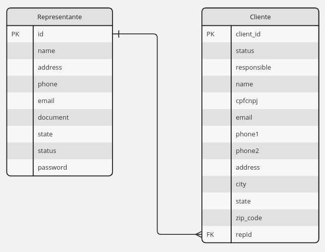

# Gerenciamento de Clientes de Vinicola

Projeto da disciplina de gerencia de projetos de ADS no IFRS

## Script para subir banco de dados no docker

1 - Certifique-se de ter o Docker instalado.
2 - Abra o cmd diretamente na pasta raiz do projeto e rode o seguinte comando:

docker-compose up -d

Este comando inicializará uma imagem do MySql em um container

## Script para criação do banco de dados



use gerenciamentoclientes;

```
CREATE TABLE representante 
(
  id bigint unsigned NOT NULL AUTO_INCREMENT,
  name varchar(100) NOT NULL,
  address varchar(250),
  phone varchar(15),
  email varchar(50) CHARACTER SET ascii COLLATE ascii_general_ci NOT NULL,
  document varchar(14),
  state varchar(2),
  status int DEFAULT 0,
  password varchar(100) NOT NULL,
  PRIMARY KEY (id),
  UNIQUE KEY id (id)
);
```

para tornar algum usuário o adm, rodar o seguinte script
UPDATE representante SET status = 2 WHERE id = :id;


ALTER USER 'gerenciamentoclientes'@'%' IDENTIFIED WITH mysql_native_password BY '123456';
testando 

```
CREATE TABLE cliente (
  client_id INT PRIMARY KEY AUTO_INCREMENT,
  status INT NOT NULL,
  responsible VARCHAR(100) NOT NULL,
  name VARCHAR(100) NOT NULL,
  cnpj VARCHAR(20) NOT NULL,
  email VARCHAR(100) NOT NULL,
  phone1 VARCHAR(20) NOT NULL,
  phone2 VARCHAR(20),
  address VARCHAR(250) NOT NULL,
  city VARCHAR(100) NOT NULL,
  state VARCHAR(50) NOT NULL,
  zip_code VARCHAR(10) NOT NULL,
  repId bigint unsigned NOT NULL
);
```